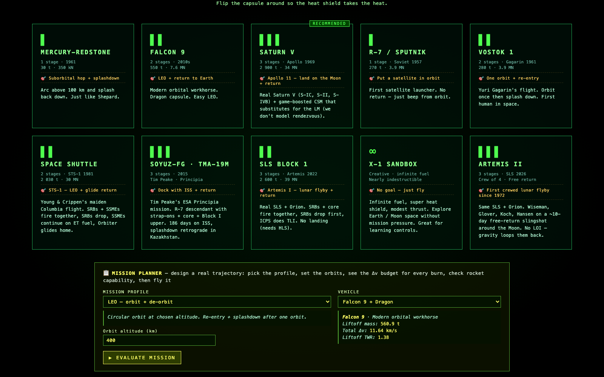
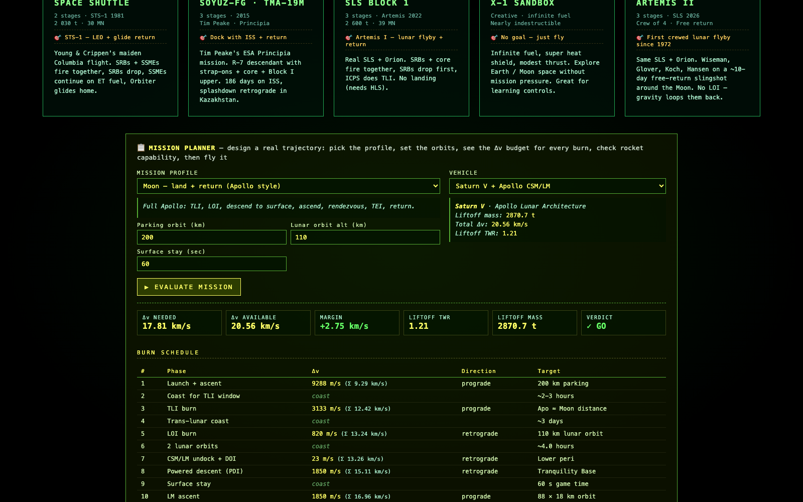
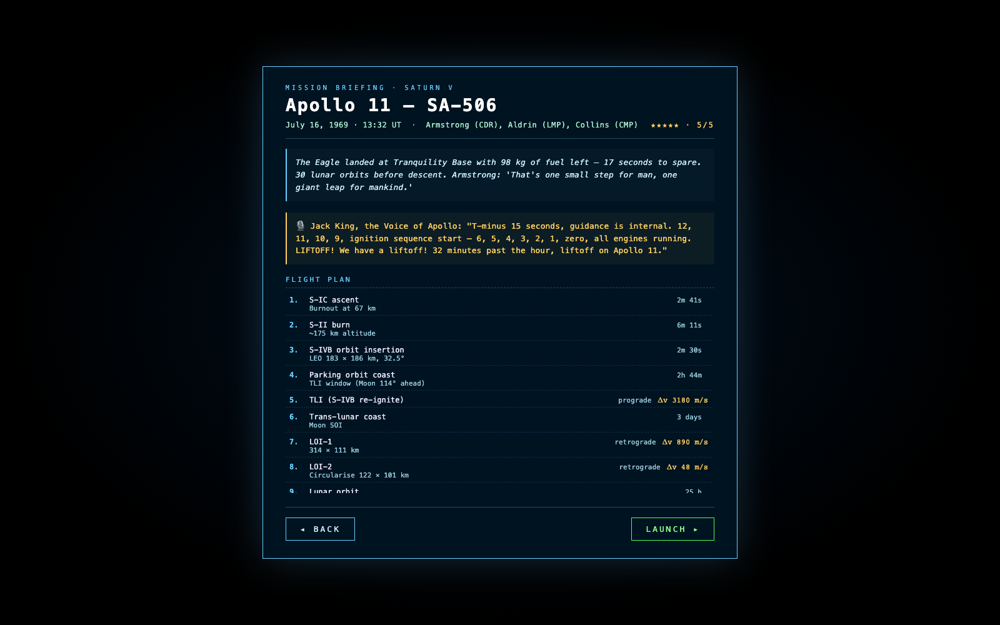
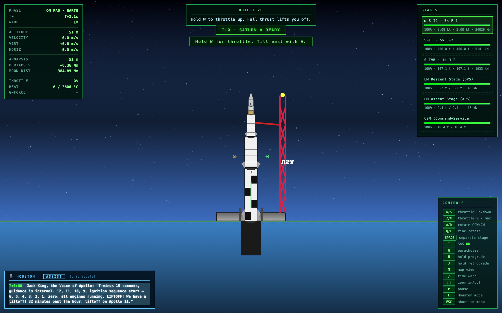
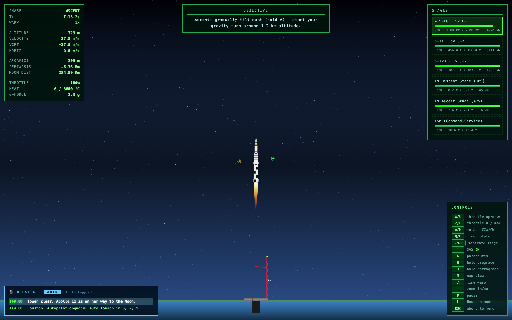
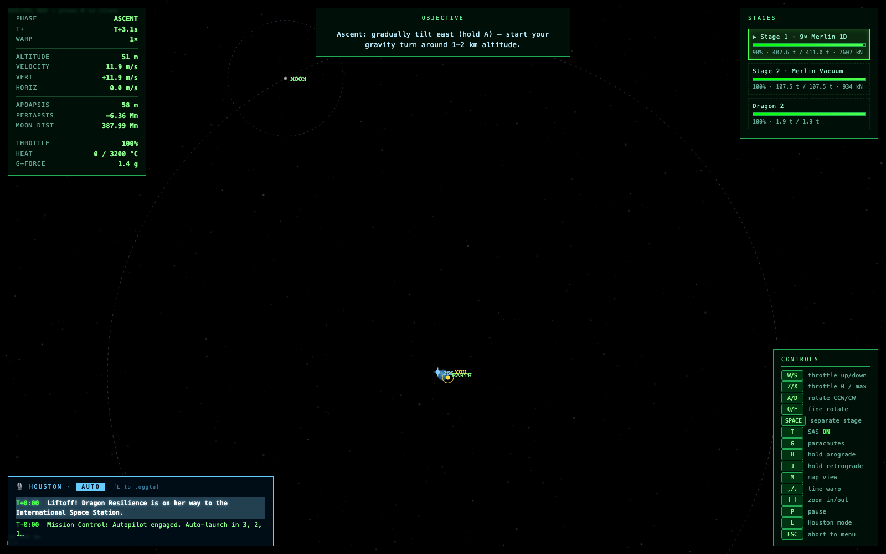
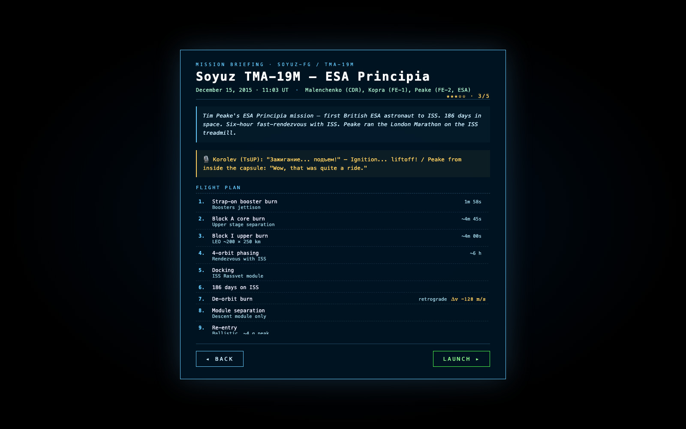
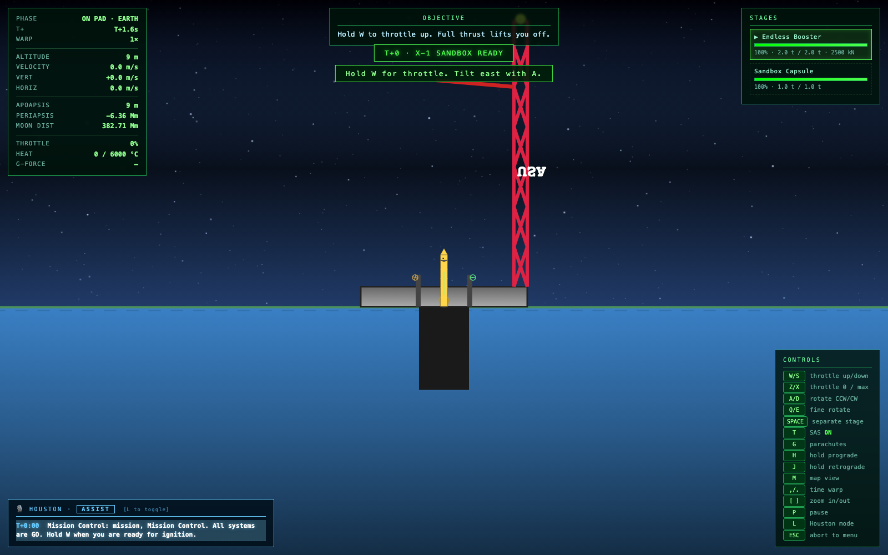

# 🚀 MOONSHOT

[](CHANGELOG.md)
[](LICENSE)
[](docs/PLAN.md)

> **Real physics. Real rockets. Real Moon.**
> Fly Apollo 11 to the lunar surface. Slingshot Artemis II around the far side. Dock Tim Peake's Soyuz with the ISS. Bring Columbia home to a runway. Plan your own mission with a real Δv budget.

A 2D, browser-based space-flight simulator built around Newtonian orbital mechanics, real spacecraft specs from NASA / Roscosmos / ESA / SpaceX, and an autopilot that flies the actual mission profile of every rocket on the menu.



---

## What's in the box

**11 real spacecraft, every number from the actual flight manual:**

| Vehicle | Mission | Year | Status |
|---|---|---|---|
| Mercury-Redstone 3 — *Freedom 7* | Suborbital hop + splashdown | 1961 | ✅ |
| R-7 / Sputnik 1 | First satellite to orbit | 1957 | ✅ |
| Vostok 1 — *Poyekhali!* | Gagarin's one orbit + parachute landing | 1961 | ✅ |
| Falcon 9 + Crew Dragon | Crew-1 to ISS, splashdown | 2020 | ✅ |
| Space Shuttle STS-1 — *Columbia* | LEO + glide to runway | 1981 | ✅ |
| Soyuz-FG / TMA-19M — *Principia* | Tim Peake to ISS + return | 2015 | ✅ |
| Saturn V / Apollo 11 | Land on the Moon, come home | 1969 | ✅ |
| SLS Block 1 / Artemis I | Uncrewed lunar orbit + return | 2022 | ✅ |
| SLS Block 1 / Artemis II | First crewed lunar flight since 1972 | 2026 | ✅ |
| X-1 Sandbox | Infinite fuel, indestructible — go anywhere | — | ✅ |
| Custom (mission planner) | You design the trajectory | — | ✅ |

Plus the **International Space Station** as a real orbital target — visible on the map and in close-up flight, with proximity-based docking detection.

---

## Highlights

### Real physics

- **Newtonian gravity** from Earth and Moon (sphere of influence around the Moon, full N-body in flight)
- **Tsiolkovsky rocket equation** drives the autopilot's Δv accounting and the planner's go/no-go
- **Atmospheric drag** with exponential density model (Kármán line at 100 km, real scale height of 8.5 km)
- **Sutton-Graves stagnation heating** with direction-aware heat shields (capsule rear or shuttle belly)
- **Lifting-body physics** for the Space Shuttle Orbiter (L/D ratio, AoA-driven lift force perpendicular to velocity)
- **Real Earth rotation** at the equator (465 m/s eastward — used as a launch-energy bonus)
- **Real Moon position** at every mission's actual launch date — the planner uses Meeus' lunar ecliptic-longitude formula keyed off the Julian Date so when you launch Apollo 11 the Moon is where it really was on July 16 1969 at 13:32 UT
- **Adaptive substepping** for stability under time warp (in atmosphere: 50 ms steps; in vacuum: 2 s steps)

### Real mission profiles, flown by Houston autopilot

Every rocket can be flown manually or handed to Houston, which executes the actual flight profile for that vehicle:

- **Apollo 11**: S-IC ascent → S-II → S-IVB to LEO → 2 h 44 m parking-orbit coast → S-IVB TLI burn → 3-day trans-lunar coast → LOI → CSM/LM undock → powered descent → surface stay → LM ascent → rendezvous + dock with ghost CSM → TEI → trans-Earth coast → re-entry → splashdown
- **Artemis II**: SRBs + core boost phase → core solo → ICPS → wide-loop lunar orbit (free-return geometry) → return
- **Soyuz TMA-19M**: R-7 parallel-staged ascent → orbit → 6-hour fast-rendezvous with ISS → dock → undock → de-orbit → ballistic re-entry → soft landing on the steppe
- **Space Shuttle STS-1**: SRBs + SSMEs together → SRB jettison at T+2:04 → SSMEs on ET to MECO → ET drop → OMS-2 burn → coast → de-orbit → 40°-AoA hypersonic glide → flare → runway landing at ~100 m/s

### Mission planner



Pick a profile (LEO / ISS dock / Lunar flyby / Lunar orbit / Apollo land / GTO+GEO), choose a vehicle, set the orbit altitudes — and the planner:

1. Computes the **Δv budget per phase** from real orbital mechanics (Hohmann transfers, vis-viva, Tsiolkovsky)
2. Computes the **rocket's available Δv** by walking each stage from the bottom up, summing `Isp × g₀ × ln(m_wet / m_dry)`
3. Accounts for **Apollo-style CSM/LM undocking** so the LM stages aren't penalised by carrying the CSM mass
4. Checks **liftoff TWR** (min 1.05, ideally 1.2+)
5. Returns a **GO / NO-GO** verdict with warnings for low margin, low TWR, unsafe lunar altitude, Van Allen belt crossings, etc.
6. Builds a **burn schedule** with Δv, direction (prograde / retrograde / radial / mixed), and target for every burn

Then hit **LAUNCH MISSION** and Houston flies the plan.

### Houston CapCom (3 modes)

- **OFF** — quiet flight, pure stick-and-rudder
- **ASSIST** — narrates each phase, calls out Max-Q, MECO, stage events, gives burn instructions, never touches the controls
- **AUTOPILOT** — Houston flies the entire mission. Disengages on any pilot input.

Each program has its own dialect: Apollo gets Jack King's countdown ("T-minus 15 seconds, guidance is internal..."), Artemis gets Charlie Blackwell-Thompson ("For the Artemis Generation, this is for you"), Soyuz gets Korolev's TsUP team ("Поехали!"), STS-1 gets the original Mission Control launch call.

### Houston Watchdog (v0.7.0)

A second supervisor running per physics substep alongside the autopilot. Knows the expected flight envelope of every mission phase from the per-mission flight plans in [`docs/missions/`](docs/missions/). When the actual trajectory diverges — TLI underburn, lunar perilune too low, ISS approach too fast, deorbit angle wrong, module-sep failure — the watchdog reacts: callout to the feed, drop time-warp, fire a corrective MCC trim burn, or replan to a different phase. Runs in every CapCom mode, including manual-flight, so you get real-time deviation feedback even when Houston isn't touching the controls. See [`docs/WATCHDOG.md`](docs/WATCHDOG.md) for the architecture spec.

### Pre-launch briefings



Every mission has a real briefing modal: actual launch date and time (UTC), real crew names, difficulty rating, historical context, the famous launch quote from Mission Control, and a phase-by-phase flight plan with Δv per burn.

---

## Screenshots

### Saturn V on the pad


### Saturn V mid-ascent under autopilot


### Orbital map (with ISS marker)


### Soyuz TMA-19M briefing — Tim Peake's Principia mission


### X-1 Sandbox — infinite-fuel free-flight


---

## Controls

| Key | Action |
|---|---|
| `W / S` | Throttle up / down |
| `Z / X` | Throttle 0 / max |
| `A / D` | Rotate CCW / CW |
| `Q / E` | Fine rotate |
| `SPACE` | Separate stage / deploy satellite |
| `T` | Toggle SAS |
| `G` | Deploy parachutes |
| `H` | Hold prograde |
| `J` | Hold retrograde |
| `M` | Map view |
| `,` `.` | Time warp down / up |
| `[` `]` | Zoom in / out |
| `P` | Pause |
| `L` | Houston mode (off / assist / auto) |
| `ESC` | Abort to menu |

---

## Running it

No build step. No npm install. Just open `index.html` in a modern browser, or serve the folder over HTTP:

```bash
cd moonshot
python3 -m http.server 8080
# then open http://127.0.0.1:8080/
```

Playwright tests (optional):
```bash
npm install
npm test                            # autopilot regression for every ship
node test-autofly-all.mjs apollo    # one ship at a time
npm run test:smoke                  # quick all-ships load test
npm run test:moonpos                # verify Moon positions match each launch date
npm run test:planner                # mission-planner Δv verification
```

### Cutting a release

The repo follows [Semantic Versioning](https://semver.org/). See [CHANGELOG.md](CHANGELOG.md)
for what's in each release and [docs/PLAN.md](docs/PLAN.md) for the roadmap.

```bash
npm run release patch    # 0.5.0 → 0.5.1
npm run release minor    # 0.5.0 → 0.6.0
```

The release script gates on a green regression run, bumps `package.json`,
prompts you to add the CHANGELOG entry, and creates an annotated git tag.
Pushing is left as a manual step.

---

## Project layout

```
moonshot/
├── index.html              ← single page
├── style.css               ← retro-terminal green aesthetic
├── js/
│   ├── constants.js        ← physics constants, all 11 spacecraft blueprints, mission briefings
│   ├── util.js             ← Vec math, atm density, orbital element solver
│   ├── body.js             ← celestial body class (gravity source + rotation)
│   ├── craft.js            ← rocket physics: stages, thrust, drag, lift, heating, landing
│   ├── trajectory.js       ← N-body trajectory predictor for the map view
│   ├── houston.js          ← CapCom dialog + autopilot state machine (28+ phases)
│   ├── planner.js          ← mission planner: Δv budget + Tsiolkovsky stack analysis
│   ├── render.js           ← canvas rendering: bodies, surface views, clouds, stages, capsule shapes
│   ├── ui.js               ← HUD, objective text, end-of-mission screen
│   ├── input.js            ← keyboard handling
│   └── game.js             ← state machine, main loop, mission start, ISS, ghost CSM
└── docs/
    └── screenshots/
```

No frameworks. No bundler. Classic `<script>` tags so it works straight off `file://` if you don't want a server.

---

## Design notes

### Apollo CSM/LM rendezvous
Real Apollo: CSM stays in lunar orbit while the LM descends, lands, ascends, then rendezvous + docks with the CSM. We model this with a "ghost CSM" — when the LM undocks for descent, the CSM becomes a passive Keplerian object orbiting the Moon under gravity; on LM ascent the autopilot completes the docking once the LM achieves a stable lunar orbit. The Δv planner respects this: LM stages are computed solo so Apollo's 17.6 km/s budget actually closes.

### Artemis II's lunar loop
Real Artemis II's hybrid free-return loops around the lunar far side at ~9,500 km — it's geometrically a single very-eccentric orbit. We model it as a wide lunar orbit (`lunarApo` 9500 km, `lunarPeri` 7500 km) with a small LOI burn so the loop is visible on the map, rather than a hyperbolic flyby that would zip past at 41,000 km altitude.

### The TLI window
When Houston flies a Moon mission, it parks in LEO and waits for the Moon to be exactly 114° ahead of the craft before firing TLI. This is the Hohmann phase angle for a ~3-day transfer — the same calculation used by Apollo's mission planners.

### G-force calc
The HUD shows **proper acceleration** — what an accelerometer on the craft actually reads — not coordinate acceleration. A craft in free-fall reads 0g; a craft sitting on the launch pad reads 1g. Real Apollo S-IC peak was 3.9g, S-II 1.85g, re-entry 7g, and the autopilot matches those numbers.

### Stage Δv calc and the Apollo undock trick
`rocketDeltaV()` walks the stack bottom-up summing Isp × g₀ × ln(wet/dry) per stage. For Apollo-style stacks (LM Descent + LM Ascent stages present) it computes those stages assuming the CSM has been left in lunar orbit — otherwise the LM Ascent's 4.7 t and 15.6 kN APS engine could never lift the 30 t CSM, and the planner would falsely declare Apollo impossible.

---

## Credits & references

- **Apollo numbers**: NASA Apollo Saturn V flight manuals; Apollo 11 flight plan
- **R-7 / Soyuz**: Roscosmos public Soyuz-FG technical descriptions
- **Falcon 9 / Dragon**: SpaceX press kits (Crew-1)
- **SLS / Orion**: NASA SLS Block 1 reference; Artemis I post-flight summary; Artemis II planning documents
- **Shuttle**: NASA STS-1 mission report; Space Shuttle Reference Manual
- **Lunar ephemeris**: Meeus, *Astronomical Algorithms* — mean lunar ecliptic longitude formula
- **Sutton-Graves heating**: NASA TM-58153 simplified stagnation-point heat-flux correlation
- **Built with**: claude-code

---

## License

MIT — go fly something.
